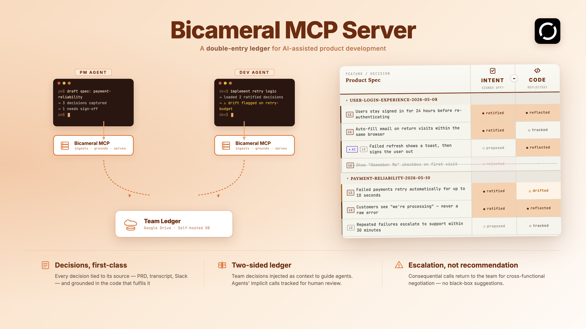
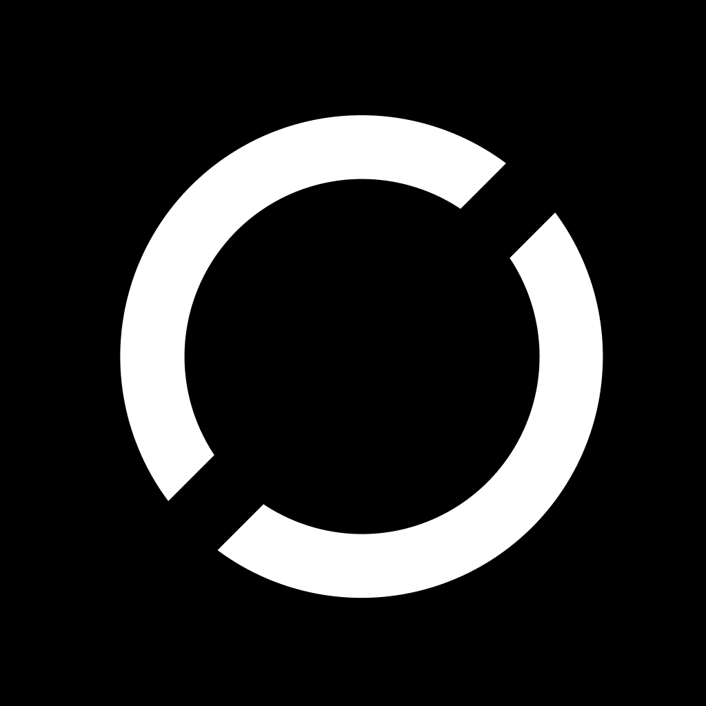

# Bicameral MCP

[](https://pypi.org/project/bicameral-mcp/)
[](https://pypi.org/project/bicameral-mcp/)
[](https://opensource.org/licenses/MIT)
[](https://github.com/BicameralAI/bicameral-mcp/actions)

AI agents ship code fast. They forget what your team agreed — and requirement gaps surfaced mid-implementation are buried under thousands of lines of code.

Bicameral MCP is a **spec compliance layer** for AI-assisted engineering. Local-first; runs as an [MCP server](https://spec.modelcontextprotocol.io/). It ingests your meeting transcripts, PRDs, and Slack threads, captures any mid-implementation decision that was not discussed, to be ratified async by your product owner, and pins each one to the code that implements it — so your agent finds out the moment it drifts from either the written spec or the spoken one.

---

## Quickstart

```bash
# Recommended: uv (single static binary, no Python prerequisite)
curl -LsSf https://astral.sh/uv/install.sh | sh    # one-line install if you don't have uv
uv tool install bicameral-mcp
bicameral-mcp setup
```

```bash
# Alternative: plain pip (installs into your current Python env)
pip install bicameral-mcp
bicameral-mcp setup
```

```powershell
# Windows: substitute the uv installer line with PowerShell
powershell -ExecutionPolicy ByPass -c "irm https://astral.sh/uv/install.ps1 | iex"
```

The setup wizard detects your repo, registers the MCP server with Claude Code, installs a git hook that auto-syncs the ledger after every commit, and adds a session-end hook that catches mid-session decisions you didn't explicitly ingest. Restart Claude Code and you're done.

Verify:

```bash
bicameral-mcp --smoke-test
```

---

## How It Feels

**Before implementing a feature**, your agent runs `bicameral.preflight` and surfaces:

```
(bicameral surfaced — checking Stripe webhook context)

📌 3 prior decisions in scope:
  ✓ Idempotency via Redis SETNX with 24h TTL
    src/middleware/idempotency.ts:checkIdempotencyKey:42-67
    Source: Sprint 14 planning · Ian, 2026-03-12

  ⚠ DRIFTED: Trust Stripe event.created, not server time
    src/handlers/webhook.ts:processEvent:80-92
    Drift evidence: switched to Date.now() in PR #287

~ 1 AI-surfaced question (no human source yet):
  • Should we deduplicate by event.id or (account_id, event.id)?
    Source: Slack #payments 2026-03-20
```

**See it in motion** — the loop in three beats:

**1. Ingest (PM or dev).** A transcript, PRD, or Slack thread comes in; bicameral extracts decisions and writes them to the ledger.

https://github.com/user-attachments/assets/e74ae39f-dd99-485b-8122-8c5211478eb1

**2. Preflight (auto).** Before the agent edits code, bicameral surfaces prior decisions, drifted regions, and open questions for the file in scope.

https://github.com/user-attachments/assets/8a0fdfb8-fc9a-49fc-9521-e5b5faf8646a

**3. Ratify async (product owner).** The product owner reviews captured proposals and ratifies or rejects them on their own cadence. Drift tracking activates on ratification.

https://github.com/user-attachments/assets/206e269e-49d6-407d-b338-ab3f2a2c70ec

<p align="center">
  <a href="https://github.com/BicameralAI/bicameral-mcp">
    
  </a>
</p>

---

## Solo or Team mode

Bicameral runs in two modes; the setup wizard asks you which one at install time.

| | Solo | Team |
|---|---|---|
| **Best for** | Individual builders; small projects with one decision-maker | Multiple people writing decisions for the same codebase (PMs, designers, multiple engineers) |
| **Where decisions live** | Local SurrealDB at `.bicameral/ledger.db`; not shared | One append-only `<your-email>.jsonl` per teammate; replicated via a remote substrate you provision |
| **Who can ingest** | You | Anyone on the shared substrate (PM ingests a PRD, dev pulls and surfaces it on `preflight`) |
| **What gets shared** | Nothing leaves your machine | Decision payloads, canonical IDs, signoffs. **No source code** |
| **How replication works** | N/A | Pull-only on tool invocation (~30 s freshness). No daemons, no webhooks, no central server |
| **Failure if remote is down** | N/A | Falls back to local; resync next call. No blocking |

### Team-mode remote substrate

Team mode replicates events through a substrate **you provision and own** —
nothing routes through a Bicameral-operated server, and your decision data
never crosses our infrastructure. The wizard supports two backends:

| Backend | Substrate | Setup |
|---|---|---|
| **Google Drive** (default) | A folder in your team's Google account. Each teammate writes to their own `<email>.jsonl`; everyone reads the rest. | 3-minute one-time OAuth client setup, then Create-or-Join in the wizard. |
| **Local folder** (advanced) | A directory mounted on every teammate's machine (NFS, Dropbox, syncthing). | One prompt for the path. |

S3, Dropbox-native, and Box backends are on the roadmap but not yet shipped — we
deliberately ship Drive first, validate the model with paying teams, then extend.

The Drive integration is scoped to `drive.file` — the Bicameral CLI on your
machine can only touch files it creates inside the team folder; the rest of your
Drive (other folders, Google Docs, shared files) is invisible to the CLI.
Decision data flows your-CLI ↔ Google directly; **Bicameral the company does
not receive copies of your files**. We do see aggregate OAuth telemetry (API
request counts, OAuth consent records — not contents) as the OAuth app
publisher, the same way any OAuth-using tool's vendor does. Token cache lives
at `~/.bicameral/google-drive-token.json`, mode 0600. Full security posture
and operator walkthrough: [`docs/team-mode-setup.md`](docs/team-mode-setup.md).

---

## Slash Commands

After setup, Claude Code gets these slash commands:

| Command | When to use |
|---|---|
| `/bicameral-ingest` | Paste a transcript, PRD, or Slack thread to track its decisions |
| `/bicameral-preflight` | Surface relevant decisions and drift before implementing |
| `/bicameral-history` | See all tracked decisions grouped by feature area |
| `/bicameral-dashboard` | Open the live decision dashboard in your browser |
| `/bicameral-reset` | Wipe and replay the ledger (emergency use) |

The agent also fires these automatically — `preflight` before any code change, `ingest` when you paste a document.

---

## What `setup` writes to your repo

| File | What it is |
|---|---|
| `.mcp.json` | MCP server config for Claude Code |
| `.bicameral/config.yaml` | Mode (`solo`/`team`), guided-mode flag, and (in team mode) `team.backend` + `team.folder_id`/`team.remote_root` + `team.role` |
| `.bicameral/ledger.db` | Local SurrealDB decision ledger (solo mode) |
| `.bicameral/events/<email>.jsonl` | Append-only event log per teammate (team mode) |
| `~/.bicameral/google-drive-token.json` | Drive OAuth token cache, mode 0600 (team mode + Drive backend only) |
| `.gitignore` entry | Ignores `.bicameral/` in solo mode |
| `.claude/settings.json` | PostToolUse hook (auto-sync after commits) + SessionEnd hook (capture mid-session decisions) |
| `.claude/skills/bicameral-*/SKILL.md` | Slash commands |

All data stays local. The embedded SurrealDB runs in-process — no separate server.

---

## MCP Tools Reference

<details>
<summary><strong>13 tools across two categories</strong></summary>

### Decision Ledger

| Tool | Purpose |
|---|---|
| `bicameral.ingest` | Ingest a transcript, PRD, or Slack export into the ledger |
| `bicameral.preflight` | Pre-flight: surface prior decisions and drift before coding |
| `bicameral.search` | Search past decisions by topic |
| `bicameral.brief` | Full brief for a feature area (decisions, drift, divergences, gaps) |
| `bicameral.history` | Read-only snapshot of all decisions grouped by feature |
| `bicameral.link_commit` | Sync a commit — update content hashes, re-evaluate drift |
| `bicameral.drift` | Detect drift for decisions touching a specific file |
| `bicameral.judge_gaps` | Run the business-requirement gap rubric on a topic |
| `bicameral.resolve_compliance` | Write back caller-LLM compliance verdicts |
| `bicameral.ratify` | Record product sign-off on a decision |
| `bicameral.update` | Check for and apply recommended version updates |
| `bicameral.reset` | Wipe the ledger for the current repo (dry-run by default) |
| `bicameral.dashboard` | Start the local dashboard server and return its URL |

### Code Locator

| Tool | Purpose |
|---|---|
| `validate_symbols` | Fuzzy-match symbol name hypotheses against the code index |
| `get_neighbors` | 1-hop structural graph traversal (callers, callees, imports) |

</details>

---

## Privacy & Compliance

We take privacy seriously. Bicameral runs entirely on your laptop — code, decisions, and transcripts never leave the machine unless you explicitly opt into team mode (which only shares an append-only event file via your existing git remote). Telemetry is anonymous integers + tool names only — opt out with `BICAMERAL_TELEMETRY=0`. The full posture (host-trust model, acceptable use, install-trust model, audit log, diagnose output, availability stance) is in [`docs/policies/`](docs/policies/); reporting + supply-chain attestation in [`SECURITY.md`](SECURITY.md).

---

## License

MIT
