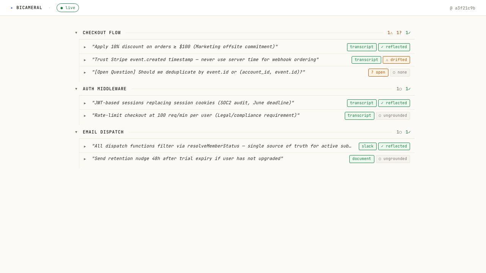

<a href="https://github.com/BicameralAI/bicameral-mcp">
  
</a>


# Bicameral MCP

[](https://pypi.org/project/bicameral-mcp/)
[](https://pypi.org/project/bicameral-mcp/)
[](https://opensource.org/licenses/MIT)
[](https://github.com/BicameralAI/bicameral-mcp/actions)

A local-first [MCP server](https://spec.modelcontextprotocol.io/) that ingests your meeting transcripts, PRDs, and Slack threads, maps every decision to the code that implements it, and surfaces alignment gaps to your AI agent — before they become bugs.

---

## Quickstart

```bash
# macOS / Linux
curl -LsSf https://raw.githubusercontent.com/BicameralAI/bicameral-mcp/main/scripts/install.sh | sh
```

```powershell
# Windows
irm https://raw.githubusercontent.com/BicameralAI/bicameral-mcp/main/scripts/install.ps1 | iex
```

The installer detects [uv](https://docs.astral.sh/uv/) (installing it first if missing), runs `uv tool install bicameral-mcp`, then launches the setup wizard. The wizard detects your repo, registers the MCP server with Claude Code, installs a git hook that auto-syncs the ledger after every commit, and adds a session-end hook for mid-session decisions you didn't explicitly ingest. Restart Claude Code and you're done.

Upgrade later:

```bash
bicameral-mcp update
```

Verify:

```bash
bicameral-mcp --smoke-test
```

---

## How It Feels

**Before implementing a feature**, your agent runs `bicameral.preflight` and surfaces:

```
(bicameral surfaced — checking Stripe webhook context)

📌 3 prior decisions in scope:
  ✓ Idempotency via Redis SETNX with 24h TTL
    src/middleware/idempotency.ts:checkIdempotencyKey:42-67
    Source: Sprint 14 planning · Ian, 2026-03-12

  ⚠ DRIFTED: Trust Stripe event.created, not server time
    src/handlers/webhook.ts:processEvent:80-92
    Drift evidence: switched to Date.now() in PR #287

~ 1 AI-surfaced question (no human source yet):
  • Should we deduplicate by event.id or (account_id, event.id)?
    Source: Slack #payments 2026-03-20
```

**At any time**, the dashboard gives you the full picture:



---

## Slash Commands

After setup, Claude Code gets these slash commands:

| Command | When to use |
|---|---|
| `/bicameral-ingest` | Paste a transcript, PRD, or Slack thread to track its decisions |
| `/bicameral-preflight` | Surface relevant decisions and drift before implementing |
| `/bicameral-history` | See all tracked decisions grouped by feature area |
| `/bicameral-dashboard` | Open the live decision dashboard in your browser |
| `/bicameral-reset` | Wipe and replay the ledger (emergency use) |

The agent also fires these automatically — `preflight` before any code change, `ingest` when you paste a document.

---

## What `setup` writes to your repo

| File | What it is |
|---|---|
| `.mcp.json` | MCP server config for Claude Code |
| `.bicameral/config.yaml` | Mode (`solo`/`team`) and guided-mode flag |
| `.bicameral/ledger.db` | Local SurrealDB decision ledger (solo mode) |
| `.gitignore` entry | Ignores `.bicameral/` in solo mode |
| `.claude/settings.json` | PostToolUse hook (auto-sync after commits) + SessionEnd hook (capture mid-session decisions) |
| `.claude/skills/bicameral-*/SKILL.md` | Slash commands |

All data stays local. The embedded SurrealDB runs in-process — no separate server.

---

## MCP Tools Reference

<details>
<summary><strong>13 tools across two categories</strong></summary>

### Decision Ledger

| Tool | Purpose |
|---|---|
| `bicameral.ingest` | Ingest a transcript, PRD, or Slack export into the ledger |
| `bicameral.preflight` | Pre-flight: surface prior decisions and drift before coding |
| `bicameral.search` | Search past decisions by topic |
| `bicameral.brief` | Full brief for a feature area (decisions, drift, divergences, gaps) |
| `bicameral.history` | Read-only snapshot of all decisions grouped by feature |
| `bicameral.link_commit` | Sync a commit — update content hashes, re-evaluate drift |
| `bicameral.drift` | Detect drift for decisions touching a specific file |
| `bicameral.judge_gaps` | Run the business-requirement gap rubric on a topic |
| `bicameral.resolve_compliance` | Write back caller-LLM compliance verdicts |
| `bicameral.ratify` | Record product sign-off on a decision |
| `bicameral.update` | Check for and apply recommended version updates |
| `bicameral.reset` | Wipe the ledger for the current repo (dry-run by default) |
| `bicameral.dashboard` | Start the local dashboard server and return its URL |

### Code Locator

| Tool | Purpose |
|---|---|
| `validate_symbols` | Fuzzy-match symbol name hypotheses against the code index |
| `get_neighbors` | 1-hop structural graph traversal (callers, callees, imports) |

</details>

---

## Privacy & Compliance

We take privacy seriously. Bicameral runs entirely on your laptop — code, decisions, and transcripts never leave the machine unless you explicitly opt into team mode (which only shares an append-only event file via your existing git remote). Telemetry is anonymous integers + tool names only — opt out with `BICAMERAL_TELEMETRY=0`. The full posture (host-trust model, acceptable use, install-trust model, audit log, diagnose output, availability stance) is in [`docs/policies/`](docs/policies/); reporting + supply-chain attestation in [`SECURITY.md`](SECURITY.md).

---

## License

MIT
