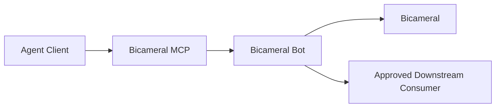

# Bicameral MCP Ecosystem Position

## Role

Bicameral MCP is the public agent-facing tool surface for Bicameral.

It exposes versioned MCP tools that let agents submit, query, and act on Bicameral context through declared contracts. It does not own canonical decision authority, local review state, code grounding, or ledger materialization.

## Position

The active local authority boundary is Bicameral Bot. MCP is the direct tool surface, not the canonical decision maker.

## Owns

- public MCP tool definitions;
- tool request and response contracts;
- client compatibility;
- transport and session behavior;
- input validation at the MCP surface;
- capability discovery;
- public package and release behavior;
- examples and conformance fixtures for supported tools.

## Consumes

- protocol and authority contracts from Bicameral Bot;
- approved product capabilities;
- agent-client MCP transport behavior;
- explicit workspace and session configuration.

## Produces

- typed requests to Bicameral Bot;
- typed responses to agents;
- capability and compatibility metadata;
- transport and tool-surface diagnostics;
- provenance references for agent-originated actions.

## Does not own

- canonical decision acceptance;
- signoff or review authority;
- local code grounding;
- decision-ledger materialization;
- hosted graph intelligence;
- source-adapter ownership;
- Qortara execution, claim, verification, release, oversight, or compliance authority;
- a separate protocol source of truth outside `bicameral-bot/protocol/`.

## Authority rule

An MCP tool request proposes or queries. It does not become canonical merely because the request came through a supported client.

Mutating actions must be evaluated by Bicameral Bot using authenticated authority context, governance policy, review state, and the applicable storage or ledger contract.

## Qortara relationship

Qortara or FailSafe-compatible clients may use Bicameral MCP to retrieve reviewed decisions, preflight context, drift, and implementation constraints.

Those integrations remain consumers. They must not treat raw MCP output as execution authority or bypass the Bot review and canonicalization boundary.

## Immediate path forward

1. Align every tool with the canonical Bot protocol and authority model.
2. Remove or deprecate protocol definitions that drift from `bicameral-bot/protocol/`.
3. Publish tool maturity and compatibility ranges.
4. Add conformance fixtures for read, proposal, review-request, and mutation paths.
5. Preserve explicit errors for unavailable Bot, incompatible protocol, missing authority, and pending review.
6. Define the minimal public context-query surface needed by Qortara and FailSafe integrations.
7. Keep transport, credentials, and sensitive context fail-visible and bounded.

## Public disclosure boundary

This public document describes stable roles and contracts. It does not expose private customer topology, security posture, unreleased product plans, or private Qortara convergence details.