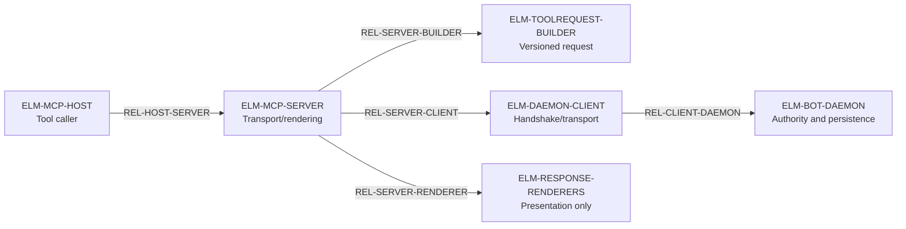

# Runtime Architecture: MCP Thin-Client Conformance Baseline

Date: 2026-07-17

Status: draft

Level: L2 cross-repo contract

Owns: the transport, routing, transient-state, and non-authority contract between MCP hosts and the local Bicameral daemon.

Related context: ADR-0001, ADR-0003, `docs/validation-554-thin-client-conformance.md`, `docs/validation-584-tagged-daemon-handshake.md`, BicameralAI/bicameral-factory#65, and BicameralAI/bicameral-factory#277.

Governance gate: `bic:spec-governance-gate` advisory/no-op. This baseline documents existing thin-client behavior and grants no new authority.

## Reading Guide

Read `Runtime Invariant`, `Conformance Gap Summary`, `Runtime State Classification`, and `Runtime Architecture Conformance` first.

## Runtime Invariant

`bicameral-mcp` is a transport and rendering client. Every canonical read or mutation is dispatched to the local bot daemon as a versioned `ToolRequest`; MCP owns no Product ledger, graph, workspace binding, source ingestion, or governance persistence.

## Runtime Problem

The MCP package contains tool schemas, client-side safety prompts, response renderers, and daemon connection logic. Without a conformance map, that surface area can be mistaken for a second control plane: code may add local durable state, route by cwd, execute a mutation without the daemon, or treat a rendered response as canonical truth.

## Conformance Gap Summary

Status vocabulary: `proven` means the required implementation and executable evidence are cited; `partial` means the path exists but the required topology evidence is incomplete; `missing` means the required implementation or evidence does not yet exist; `unresolved` means the owning contract is not yet decided.

| Conformance ids | Intended contract | Current implementation / evidence | Status | Missing evidence or work |
| --- | --- | --- | --- | --- |
| CONF-THIN-CLIENT-01 | Every canonical read/mutation crosses the daemon ToolRequest seam | Thin-client and ToolRequest conformance suites exist | proven | Preserve full tool inventory coverage as commands evolve |
| CONF-HANDSHAKE-01 | Tagged identity, protocol version, and capabilities gate dispatch | Handshake validation and tagged-daemon regression tests exist | proven | Preserve fail-closed behavior across future transports |
| CONF-EXPLICIT-ROUTING-01 | Product/workspace routing is explicit and independent of MCP cwd/restart | Request fields and workspace-bind user-path tests exist | partial | Real-process, multi-Product, cross-cwd restart topology test |
| CONF-NO-LOCAL-FALLBACK-01 | Daemon incompatibility/unavailability returns a typed error | Thin-client validation and negative dispatch tests exist | proven | Keep every new mutation class inside the negative inventory |
| CONF-RENDER-NONAUTHORITY-01 | Rendering preserves daemon status and authority meaning | Response fixtures and renderer tests exist | proven | Maintain fixture coverage for new response kinds |

## Goals And Non-Goals

Goals:

- Make the MCP-host, server, daemon-client, and bot-daemon topology generatable.
- Classify all MCP-held state as transient request/session/cache state.
- Require protocol/capability validation before tool dispatch.
- Preserve explicit daemon-endpoint and Product/workspace parameters across restarts.

Non-goals:

- No canonical ledger, graph, audit, workspace, connector, or credential persistence in this repo.
- No direct Git/event-store writes.
- No legacy in-process mutation fallback when the daemon is unavailable or incompatible.
- No lifecycle behavior change; this is a documentation baseline.

## Runtime Components

| ID | C4 kind | Name / deployment | Responsibility | State ids | Multiplicity | Must not decide or mutate |
| --- | --- | --- | --- | --- | --- | --- |
| ELM-MCP-HOST | External software system | Claude/Codex/IDE MCP host | Discover and invoke Bicameral tools | Host-owned conversation state | Many hosts and sessions | Bicameral canonical state |
| ELM-MCP-SERVER | Container / local process | `server.py` over MCP stdio | Validate tool input, build requests, call daemon, and render responses | STATE-MCP-SESSION, STATE-CLIENT-GATE | Many processes may target one daemon | Durable Product/governance state or direct provider actions |
| ELM-TOOLREQUEST-BUILDER | Component / MCP process | `tool_request.py` | Map tool names/parameters to versioned bot-owned command envelopes | STATE-REQUEST | One per request | Execute the command or invent daemon authority |
| ELM-DAEMON-CLIENT | Component / MCP process | `daemon_client.py` | Resolve endpoint, perform capability handshake, and exchange requests/responses | STATE-CAPABILITY-CACHE | One client per process/session | Fall back to local implementation on connection/protocol failure |
| ELM-RESPONSE-RENDERERS | Component / MCP process | `responses.py` and focused renderers | Convert daemon responses into MCP content without changing semantics | STATE-RESPONSE | One per response | Treat formatting as acceptance, materialization, or approval |
| ELM-BOT-DAEMON | External container / local process | `bicameral-bot` daemon | Authorize and execute ToolRequests against registered Product state | External canonical and operator-local state | One daemon may serve many Products/clients | Delegate canonical authority to MCP |

## Runtime Relationships

| ID | Source -> destination | Interaction / medium | Handoff | State / payload | Boundary crossed |
| --- | --- | --- | --- | --- | --- |
| REL-HOST-SERVER | ELM-MCP-HOST -> ELM-MCP-SERVER | MCP over stdio | Synchronous request/response | Tool name, parameters, rendered content | Host to Bicameral client process |
| REL-SERVER-BUILDER | ELM-MCP-SERVER -> ELM-TOOLREQUEST-BUILDER | Python call | Synchronous | STATE-REQUEST | UI/tool schema to bot-owned protocol |
| REL-SERVER-CLIENT | ELM-MCP-SERVER -> ELM-DAEMON-CLIENT | Python async call | Synchronous | STATE-REQUEST / STATE-RESPONSE | MCP process to transport seam |
| REL-CLIENT-DAEMON | ELM-DAEMON-CLIENT -> ELM-BOT-DAEMON | Tagged local HTTP/JSON protocol | Synchronous with retry only where contract permits | Capability report, `ToolRequest`, `ToolResponse` | Client process to local authority boundary |
| REL-SERVER-RENDERER | ELM-MCP-SERVER -> ELM-RESPONSE-RENDERERS | Python call | Synchronous | STATE-RESPONSE | Authoritative daemon result to presentation |

## Derived Topology View

This review aid is generated from the `ELM-*` and `REL-*` tables. It introduces no independent node, edge, or authority claim.

## Runtime State Classification, Authority, Persistence, And Routing

| ID | Artifact / classification | Authoritative writer | Persistence owner / location | Readers | Routing key | Mutation path / lifecycle | Prohibited fallback |
| --- | --- | --- | --- | --- | --- | --- | --- |
| STATE-MCP-SESSION | Local scratch | MCP server/host | Process memory only | Current MCP process | Host session | Created on process start; discarded on exit | Persist as Product or governance state |
| STATE-CLIENT-GATE | Local scratch / advisory client gate | MCP server | Process memory only | MCP server | Tool + request scope | Cleared with process; daemon remains final authority | Gate result as canonical approval or durable review state |
| STATE-CAPABILITY-CACHE | Cache | Daemon client from daemon handshake | Process memory only | MCP server/client | Daemon endpoint and protocol version | Refresh on connection/start; discard on mismatch/restart | Assume capabilities, use stale cache after mismatch, or silently downgrade |
| STATE-REQUEST | Transient command envelope | ToolRequest builder | Request memory only | Daemon client and bot daemon | Request id, command, explicit Product/workspace fields | Created per call; consumed by daemon | Infer Product from cwd or write directly from MCP |
| STATE-RESPONSE | Transient response/projection | Bot daemon; MCP only renders | Request memory/stdio response | MCP host/user | Request id and response kind | Returned then discarded | Renderer changes authority outcome or stores it canonically |

## State Refinement Check

Release state: no lifecycle behavior changed. MCP starts, validates daemon compatibility, dispatches one ToolRequest at a time, renders the daemon response, and loses all local scratch/cache state on exit.

States added, split, merged, or retired: none.

| ID | Trigger | Authority | Persistence effect |
| --- | --- | --- | --- |
| TRANS-HANDSHAKE | MCP server starts or reconnects | ELM-DAEMON-CLIENT validates ELM-BOT-DAEMON report | Refresh STATE-CAPABILITY-CACHE in memory |
| TRANS-DISPATCH | Host invokes a supported tool | ELM-MCP-SERVER builds; ELM-BOT-DAEMON authorizes/executes | No MCP persistence; daemon may mutate its owned stores |
| TRANS-RENDER | Daemon returns a typed response | ELM-RESPONSE-RENDERERS | STATE-RESPONSE returned over stdio, then discarded |
| TRANS-REJECT-INCOMPATIBLE | Handshake/version/capability validation fails | ELM-DAEMON-CLIENT | No dispatch and no fallback mutation |

Invariants:

- No canonical state, authority, or persistence semantics changed.
- Client-side prompts/gates do not replace daemon policy or durable review.
- Working directory never selects Product identity.
- A protocol mismatch fails closed.

Deferred: remote daemon transport, durable MCP sessions, and hosted MCP authority.

## State Minimization Review

No new state is introduced. Capability knowledge remains a cache, requests/responses remain transient, and client gates remain process-local. A durable MCP operation ledger is rejected because it would duplicate bot-owned audit and canonical state.

## Authority Ownership Matrix

| Element | Observe | Propose | Validate | Accept / execute | Materialize | Render |
| --- | --- | --- | --- | --- | --- | --- |
| ELM-MCP-HOST | Tool descriptions and returned content | User tool invocation | Host schema only | No Bicameral authority | None | Host UI |
| ELM-MCP-SERVER | Tool input and daemon response | ToolRequest envelope | Local schema and safety prompt | No canonical acceptance | None | MCP content |
| ELM-DAEMON-CLIENT | Endpoint/capability/transport | None | Protocol compatibility | No domain authority | Capability cache only | Transport errors |
| ELM-BOT-DAEMON | Registered Product and policy state | Governed candidates/actions | Product/policy/actor | Authorized ToolRequest | Owned stores/event adapters | Typed ToolResponse |

## Runtime Scenarios

### SCN-STARTUP-HANDSHAKE

The MCP server resolves an explicit daemon endpoint, requests the tagged capability report, and validates protocol version plus required capabilities. Only a compatible report permits tool dispatch.

### SCN-TOOL-DISPATCH

The host invokes a tool. MCP builds a canonical ToolRequest, preserving explicit Product/workspace identifiers, and sends it to the daemon. The daemon authorizes and executes; MCP renders the typed response.

### SCN-RESTART

After MCP restart, the capability cache and client gates are empty. The new process handshakes again and uses the same explicit daemon/Product routing inputs. No MCP-local replay or durable fallback is consulted.

### SCN-FORBIDDEN-LOCAL-MUTATION

The daemon is unavailable or lacks a capability, and MCP executes a legacy Python implementation, writes a repo-local ledger, or infers a workspace from cwd. This path is forbidden and must return a recovery error.

UserJourney: not applicable. This baseline owns the generic local MCP-to-daemon transport seam rather than a named end-to-end Product journey. MCP creates no durable fact, has one authoritative commit boundary (the bot daemon), and has no post-commit step that can independently persist, replay, or resume. Tool-specific work that participates in `hosted_project_creation` or another user-visible path must bind that journey explicitly.

Journey Boundary Review: not applicable for this baseline because MCP request, capability-cache, and response state are process-local witnesses; only the daemon may commit Product state. The cross-cwd restart test remains required topology evidence, not a second lifecycle commit.

## Event, Command, And Protocol Contracts

`ToolRequest` is produced by `tool_request.py` and consumed by the bot daemon. The envelope carries protocol version, request identity, command, parameters, and explicit routing context required by that command. Unknown tools, invalid parameters, missing local-only scope, incompatible daemon versions, and missing capabilities fail closed. `ToolResponse` semantics are daemon-owned; rendering may omit or format fields for the host but may not change status or authority meaning.

## Deployment And Runtime Topology

The MCP server and bot daemon are separate local processes. MCP communicates over the resolved tagged daemon endpoint; startup cwd is not a bootstrap input. Multiple MCP hosts/processes may share one daemon, and one daemon may serve many explicitly registered Products. Correct routing therefore depends on request/registration identity, never process-global current workspace.

## Error, Retry, Recovery, And Observability

- Daemon unavailable: return a typed recovery error; do not run a local fallback.
- Capability/version mismatch: fail before dispatch and advise compatible daemon recovery.
- Interrupted request: retry only according to ToolRequest idempotency semantics; do not assume mutation failure.
- MCP restart: re-handshake and rebuild transient state.
- Logs may record request id, command class, endpoint class, protocol version, latency, and outcome without secrets or payload bodies. Logs are not approvals or canonical events.

## Runtime Architecture Conformance

| ID | Status | Source ids | Owning Module / Seam | Required behavior | Prohibited fallback | Validation obligation | Implementation evidence |
| --- | --- | --- | --- | --- | --- | --- | --- |
| CONF-THIN-CLIENT-01 | proven | ELM-MCP-SERVER, REL-SERVER-BUILDER, REL-CLIENT-DAEMON, STATE-REQUEST, SCN-TOOL-DISPATCH | `server.py` / ToolRequest dispatch seam | Route every supported canonical read/mutation through the daemon | MCP-local ledger, graph, connector, or governance implementation | Contract test across all supported tools | `tests/test_toolrequest_thin_client.py`; `tests/test_toolrequest_conformance.py` |
| CONF-HANDSHAKE-01 | proven | ELM-DAEMON-CLIENT, STATE-CAPABILITY-CACHE, TRANS-HANDSHAKE, TRANS-REJECT-INCOMPATIBLE | `daemon_client.py` capability seam | Validate tagged identity, protocol version, and required capabilities before dispatch | Assumed capability, stale cache, untagged response, or silent downgrade | Handshake contract and regression test | `tests/test_capability_handshake_validation.py`; `tests/test_tagged_daemon_handshake_regression.py` |
| CONF-EXPLICIT-ROUTING-01 | partial | REL-CLIENT-DAEMON, STATE-REQUEST, SCN-RESTART | ToolRequest schema / daemon routing seam | Preserve explicit Product/workspace routing fields independent of MCP cwd and process restart | Cwd, nearest repo marker, or process-global selected Product | Cross-cwd, multi-Product restart/topology test | Workspace-bind user-path tests; planned multi-Product topology fixture |
| CONF-NO-LOCAL-FALLBACK-01 | proven | TRANS-REJECT-INCOMPATIBLE, SCN-FORBIDDEN-LOCAL-MUTATION | Error/recovery seam in `server.py` and `daemon_client.py` | Return typed errors when daemon dispatch is unavailable or unsupported | Legacy in-process mutation or direct store write | Negative dispatch test for every mutation class | `docs/validation-554-thin-client-conformance.md` and thin-client tests |
| CONF-RENDER-NONAUTHORITY-01 | proven | ELM-RESPONSE-RENDERERS, REL-SERVER-RENDERER, STATE-RESPONSE | Response formatting seam | Preserve daemon response status and authority semantics | Formatter promotes candidate, approval, or advisory result | Fixture contract test | `tests/fixtures/toolresponses/`; renderer tests |

## Implementation And Issue Handoff

This seed is documentation-only. Future work must carry the applicable `CONF-*` ids into issue acceptance criteria. The most important gap is a real-process, multi-Product, cross-cwd restart test for `CONF-EXPLICIT-ROUTING-01`; existing unit/fixture tests must not be presented as that topology evidence.

## ADR Implications

- ADR-0001 (agent tool surface): reaffirmed.
- ADR-0003 (bot-owned protocol): reaffirmed.
- No ADR change is proposed.

## Acceptance Criteria And Validation Plan

- Stable `ELM-*`, `REL-*`, `STATE-*`, `TRANS-*`, `SCN-*`, and `CONF-*` ids trace the existing runtime.
- MCP-owned state is explicitly transient/cache-only.
- The prohibited local mutation/cwd fallback is executable as a negative test.
- `git diff --check` and the focused thin-client/handshake test suites pass.

## Open Questions

None for the baseline. The cross-cwd multi-Product topology fixture remains planned evidence.

## Request Coverage

| Request | Section |
| --- | --- |
| Seed Product-repo conformance table | `Runtime Architecture Conformance` |
| Enable C4 and state/routing diagram generation | Component, relationship, and state tables |
| Prevent MCP/control-plane conflation | `Runtime Invariant`, `CONF-THIN-CLIENT-01` |
